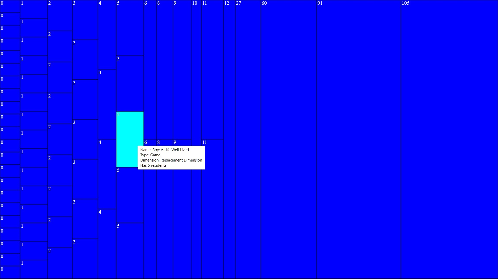
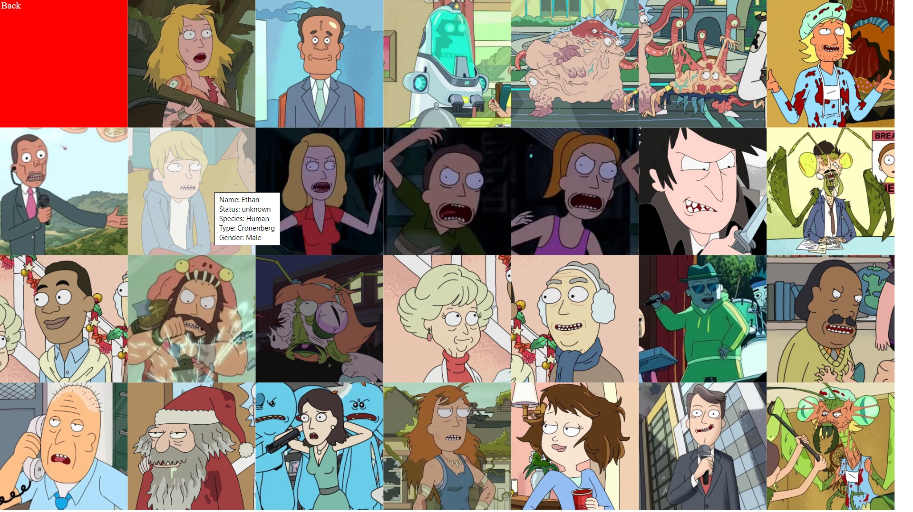

# RickAndMorty

Одностраничный клиент, созданный для демонстрации возможностей SVG.
Технологии:
* HTML SVG;
* JavaScript.

Приложение берет данные из вселенной Rick & Morty с ресурса https://rickandmortyapi.com/documentation, а затем рисует на области SVG синие прямоугольники с локациями (пропорционально их размеру). По щелчку на локации открывается список ее жителей.

| --- | ---: |
| | |
